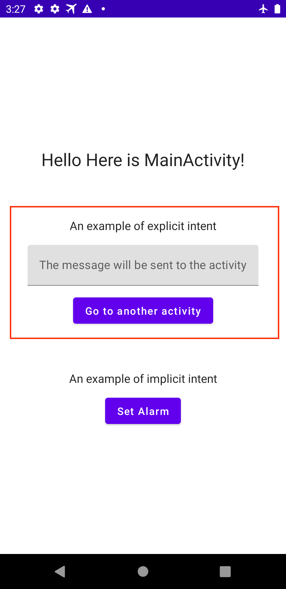
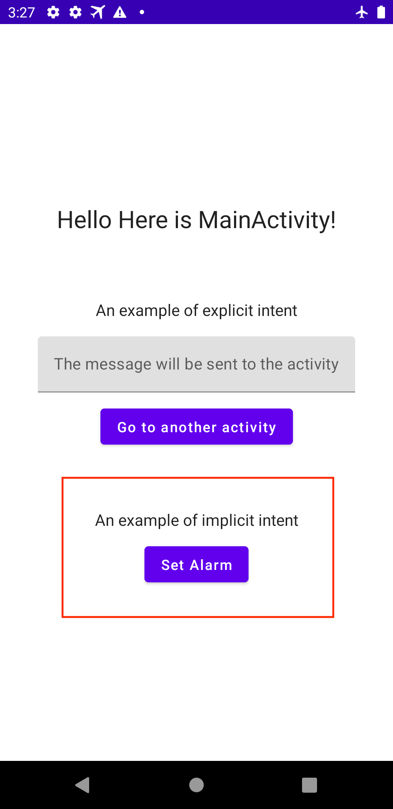

# AndroidIntentExample

Created this repository to look around what is Intent and how I use it.

## Intent

An Intent is a messaging object that is used to request an action from another components(activities, services, broadcast receivers, content providers).

Main use cases are:

- Starting an activity
- Starting a service
- Delivering a broadcast

### Starting an activity

According to the official doc:

> You can start a new instance of an Activity by passing an Intent to startActivity(). The Intent describes the activity to start and carries any necessary data.

To start an activity, we have two ways. One is using an explicit intent and the other is using implicit intent. Let's look into what they are and how we use them as code.

#### With explicit intents

> An explicit intent is one that you use to launch a specific app component, such as a particular activity or service in your app.

In this repository I added a form and button to check out an explicit intent. When you fill some text in the field and press the button, an intent is sent to another activity with the message.

At [MainActivity.kt#L89-L95](https://github.com/alpaca0984/AndroidIntentExample/blob/main/app/src/main/java/com/example/androidintentexample/MainActivity.kt#L89-L95) I initialize an intent with explicitly specifying an activity which will receive the intent. And at [FooActivity.kt#L19-L20](https://github.com/alpaca0984/AndroidIntentExample/blob/main/app/src/main/java/com/example/androidintentexample/FooActivity.kt#L19-L20), the activity receives the intent and extract data from it.

#### With implicit intents

> An implicit intent specifies an action that can invoke any app on the device able to perform the action

When you press the "Set Alarm" button, a time picker appears and once you set a certain time, the Android's Alarm App launches and set alarm with specified time.

At [MainActivity.kt#L113-L117](https://github.com/alpaca0984/AndroidIntentExample/blob/main/app/src/main/java/com/example/androidintentexample/MainActivity.kt#L113-L117) the app sends an implicit intent to the Alarm App and the intent is consumed anyhow.

### Delivering a broadcast

> Android apps can send or receive broadcast messages from the Android system and other Android apps.
> Apps can register to receive specific broadcasts. When a broadcast is sent, the system automatically routes broadcasts to apps that have subscribed to receive that particular type of broadcast.

I created a [AirplaneModeBroadcastReceiver](https://github.com/alpaca0984/AndroidIntentExample/blob/main/app/src/main/java/com/example/androidintentexample/AirplaneModeBroadcastReceiver.kt) that shows a toast when airplane mode has been turned on. [MainActivity.kt#L54-L57](https://github.com/alpaca0984/AndroidIntentExample/blob/main/app/src/main/java/com/example/androidintentexample/MainActivity.kt#L54-L57) registers it so that whenever airplane mode is changed it will be notified to the AirplaneModeBroadcastReceiver.

## Resources

- [Intents and Intent Filters](https://developer.android.com/guide/components/intents-filters)
- [Broadcasts overview](https://developer.android.com/guide/components/broadcasts)
